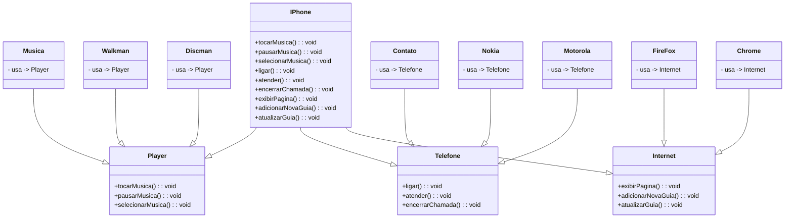

# dio-projetos!

## Represenação UML!!

```mermaid

classDiagram

class IPhone {
    +tocarMusica() : void
    +pausarMusica() : void
    +selecionarMusica() : void
    +ligar() : void
    +atender() : void
    +encerrarChamada() : void
    +exibirPagina() : void
    +adicionarNovaGuia() : void
    +atualizarGuia() : void
}

class Player {
    +tocarMusica() : void
    +pausarMusica() : void
    +selecionarMusica() : void
}

class Musica {
    - usa -> Player
}

class Walkman {
    - usa -> Player
}

class Discman {
    - usa -> Player
}

class Telefone {
    +ligar() : void
    +atender() : void
    +encerrarChamada() : void
}

class Contato {
    - usa -> Telefone
}

class Nokia {
    - usa -> Telefone
}

class Motorola {
    - usa -> Telefone
}

class Internet {
    +exibirPagina() : void
    +adicionarNovaGuia() : void
    +atualizarGuia() : void
}

class FireFox {
    - usa -> Internet
}

class Chrome {
    - usa -> Internet
}

IPhone --|> Player
IPhone --|> Telefone
IPhone --|> Internet
Musica --|> Player
Walkman --|> Player
Discman --|> Player
Contato --|> Telefone
Nokia --|> Telefone
Motorola --|> Telefone
FireFox --|> Internet
Chrome --|> Internet
```
